<div align="center">


# PayGate

**The open standard for AI-to-API micro-payments on Stellar.**


<br />

[](https://github.com/sauravs296/PayGate/actions/workflows/web.yml)
[](https://github.com/sauravs296/PayGate/actions/workflows/contracts.yml)
[](https://github.com/sauravs296/PayGate/actions/workflows/docs.yml)
[](https://paygate-stellar-swart.vercel.app/)

</div>

---

## 🔗 Important Links

- **Live Application**: [https://paygate-stellar-swart.vercel.app/](https://paygate-stellar-swart.vercel.app/) *(Live PayGate Application)*
- **Documentation**: [https://paygate-stellar-docs.vercel.app](https://paygate-stellar-docs.vercel.app) *(Official PayGate Documentation)*
- **Demo Video**: [https://youtu.be/We9RWRjFwhE](https://youtu.be/We9RWRjFwhE)
- **Product Presentation**: [Pitch Deck](https://docs.google.com/presentation/d/15E_DW4QLpHEOPaBc1RR-19-DtCQF3gpUOGvkk8_NLik/edit?usp=sharing)
---

## 🛑 The Problem

The current API economy is built for humans and credit cards, not AI agents. When an autonomous AI needs to access premium data (like real-time weather, stock prices, or compute APIs), it hits a paywall. To get past it, a human developer has to manually sign up for an API key, enter a credit card, commit to a monthly subscription, and hardcode that key into the agent. 

**This breaks the autonomy of AI.** AI agents cannot hold bank accounts or sign up for SaaS subscriptions. As we move towards an agent-to-agent economy, we need a way for software to autonomously negotiate and pay for data in real-time, on a per-request basis, without human intervention.

## 🌉 How PayGate Solves This (The x402 Protocol)

PayGate bridges this gap using the **x402 protocol** and the **Stellar blockchain**. 

When an AI agent requests data from a PayGate-protected API without a payment, the server intercepts the request and responds with a standard HTTP `402 Payment Required` status code. But instead of just an error message, the response includes an `x402` header containing a crypto invoice (specifying the price in USDC and the destination wallet).

The agent automatically intercepts this 402, constructs a micro-transaction on the Stellar network using its own built-in crypto wallet, and retries the request with the transaction signature attached. PayGate verifies the payment instantly and serves the data. 

**Result:** True machine-to-machine commerce. Pay-per-call, settled instantly in USDC, with zero subscriptions and zero human onboarding.

### 🏢 Real World Example Business

Imagine **"WeatherData Inc,"** a company that provides highly accurate, real-time meteorological data. 
- **Currently:** They sell $500/month enterprise API subscriptions. Startups and independent AI developers can't afford this, so WeatherData misses out on the long tail of the market.
- **With PayGate:** WeatherData registers their endpoint on PayGate and sets a price of **$0.002 USDC per call**. An autonomous farming drone AI needs wind data to optimize its flight path. It pings the API, pays $0.002 instantly from its onboard wallet, gets the data, and flies. WeatherData monetizes a micro-interaction they would have otherwise lost, and the AI remains fully autonomous.

---

## 🗣️ User Feedback

We are constantly improving PayGate based on developer feedback.
- **[Submit Feedback Form](https://forms.gle/uXD8V1NSdWmEhp7z7)**
- **[View Feedback Responses](https://docs.google.com/spreadsheets/d/1ZuNnwy3OEF6_WV_hg7zTXq6VYlpUsgL9_eiR7rBNLt4/edit?usp=sharing)**

### Latest Feedback Responses

| Full Name | Wallet Address (Testnet) | x402 Exp | Satisfaction | Tx Speed | UI Design | Security | Primary Reason | Bugs/Issues | Suggestions | Recommend | Commits |
|---|---|---|---|---|---|---|---|---|---|---|---|
| Soumen Mandal | `GAEOFN7X2JSDH5BSM46P7EDDFRKFEJMW7PTSDOGBDGHUPOM7MEXSIZQE` | 4/5 | 5/5 | Excellent | Excellent | Excellent | Low fees, Fast processing | None | All good | 10/10 | NiL |
| Aditya Jha | `GCX3LFQ2BXHVEVL5VD7DZ4Y3R6WIUNUTJNZRMGRMWLM33XD2J7YFFLQA` | 3/5 | 5/5 | Excellent | Excellent | Good | Low fees, Ease of use, Fast processing | NA | Need more for dev dashboard | 8/10 | NiL |
| Debansh Tiwari | `GDFKLTB5WKKDDJ2NRU2V5OG476HYEGWT4UFV7BID7BNGWZGRZYL3LL6Z` | 2/5 | 4/5 | Good | Fair | Excellent | Low fees, Ease of use, Fast processing, Integrations | Missing docs option in API creation | Enhance dev dashboard UI | 8/10 | [`165b188`](https://github.com/sauravs296/PayGate/commit/165b188fc680620cf2794ab87156813a9781a8d1) |
| Saurav Tiwari | `GALK4MID2BKRGDIFYAGRBJ3P2ZDSQJQASWMFAEMP25DPO2O5ISMXVTTB` | 2/5 | 5/5 | Excellent | Fair | Excellent | Low fees, Ease of use, Fast processing | None | Provide more dev resources for monetization | 7/10 | NiL |
| Suman Pradhan | `GA4DBFJ7O7VXZDFFP3DARCCQHZLVTDD4YBLS4KKLYHT2BDA3S5MEMA67` | 4/5 | 3/5 | Good | Good | Good | Low fees, Ease of use, Fast processing, Integrations | Enhance testing screen | Enhance the testing page | 9/10 | [`087055f`](https://github.com/sauravs296/PayGate/commit/087055fb3dd256a73265bf35eff0e235fd6e77cb) |
| Souradip Pal | `GCJWSEXMUW3B2SHKMAGKQ5ZD56V2YHHTRGYETS3WV2IN3ISXKVRWLSP7` | 4/5 | 5/5 | Excellent | Fair | Good | Low fees, Ease of use, Fast processing, Integrations | Couldn't find a withdrawal option | Keep it simple | 9/10 | [`80d2456`](https://github.com/sauravs296/PayGate/commit/80d24567752b7da1750cd54ca26e558cfce4011b) |
| Valid Cerome | `GAMEGSEK4STZPXITXH63Y5QBO5Y2LL2O2D6VYQBXB4MJMKIXC63B5KJ4` | 1/5 | 5/5 | Excellent | Excellent | Good | Ease of use | None | Explore more | 7/10 | NiL |
| Kartik Biswas | `GDKHLI3JCIRIKHOY5UJIVNEYGQOZXQSPE4SRWMKG7B77VAQE7SSYQMU6` | 1/5 | 5/5 | Excellent | Excellent | Excellent | Low fees, Ease of use | No | Loved the marketplace testing feature | 10/10 | NiL |
| Subhajit Das | `GCQ6JTOTY4IWA5URYBAMX3RGRCRZ5CO3GKIF6DQI5NIDKY47XEUY7O4G` | 3/5 | 5/5 | Good | Good | Good | Low fees, Ease of use, Fast processing | No delete option for API | Great idea with potential | 9/10 | [`f094c30`](https://github.com/sauravs296/PayGate/commit/f094c309c3a3b872aa2b6f98408d81e799114150) |
| Priyam Dey | `GDXRHYMYYF3ISS4JPQVZHHBHT7EVLAXFYCARK4HEXEQJ63HLMTK2OZ5I` | 3/5 | 4/5 | Good | Excellent | Fair | Low fees, Ease of use | No | Highlight marketplace on landing page | 7/10 | [`bf2b357`](https://github.com/sauravs296/PayGate/commit/bf2b357ca1aace385504008d052b9bdae61d7312) |
| Joya Marty | `GD37TTSTX22Y24CAKWO45IKKHEMDYVEK7MEE7QC6C4O6VAIDXCEK4VL4` | 4/5 | 4/5 | Excellent | Excellent | Excellent | Low transaction fees, Ease of use, Fast processing time, Integration options | No bugs | Its very good product for developers | 9/10 | NiL |
| Abhi Jain | `GC22Z2IN3ROLZFW3JEU64C4IZZ74Z5RZWOG4OO64FJPKNMS77GZGVBMA` | 2/5 | 5/5 | Excellent | Good | Excellent | Low transaction fees, Ease of use, Fast processing time | NO bugs encountered | enhance the lannding page a make a documentation | 9/10 | [`c0efdb7`](https://github.com/sauravs296/PayGate/commit/c0efdb7e42bddf16b519fa4b27de7dfdbb461492) |
| Arif Ali | `GBQWJUMYCSE63MT2XBAYK4BMMAJJFNTOR46QGPST4BLSPWBNGLU6FFHD` | 1/5 | 3/5 | Good | Excellent | Good | Low transaction fees, Ease of use, Fast processing time | NO ISSUES | PayGate is a very good platform | 9/10 | NiL |
| Rishi Gharia | `GC5J6BN4BXXNE6DR6OHJSRH4WH4EZEFIO4AM2KRNFZEA5DCI3QFKODKA` | 4/5 | 5/5 | Excellent | Excellent | Excellent | Ease of use, Fast processing time | No bugs encountered | Good Platform | 9/10 | NiL |
| Akansha Kumari | `GC23LEPSSBJL4VJK6LK5RIRRX2ZKJ3OTVXHJT6HSWPMZ4JJDXE3ZRUPE` | 4/5 | 3/5 | Excellent | Excellent | Excellent | Low transaction fees, Ease of use | No but I like the Marketplace area | No its good platform | 10/10 | NiL |
| Bheem Dastidar | `GDFEYX5Q7UT4ZUREVHPULKYD6C3EKWQDTJY76OXYWTRTUE7PKUSKWJZG` | 1/5 | 5/5 | Good | Good | Good | Ease of use, Fast processing time, Integration options | No bugs/issues encountered | more things to be added in the settings tab | 9/10 | [`c0efdb7`](https://github.com/sauravs296/PayGate/commit/c0efdb7e42bddf16b519fa4b27de7dfdbb461492) |
| Sahil Rao | `GBJA4Z6IXQLVZWMM3U7C7PFRFHWO7CZ3S62SPC6TX2NLV4XS2MQHBC4F` | 4/5 | 4/5 | Excellent | Excellent | Good | Low transaction fees, Ease of use, Fast processing time | NA | in profile more detiasl could have been taken | 10/10 | [`c0efdb7`](https://github.com/sauravs296/PayGate/commit/c0efdb7e42bddf16b519fa4b27de7dfdbb461492) |
| Anubhav Sen | `GDYF2MPWHTXE63DVLGG3H4JKTCBQ24OZAMGMLBMYY3IEIJLOCVD5CZDU` | 4/5 | 4/5 | Excellent | Good | Excellent | Low transaction fees, Ease of use, Fast processing time | No bugs while I gave my API key | No | 9/10 | NiL |
| Gourab Basak | `GCVODPBH7PNE6AENNEYO6PFDH3VSF5JKYH6ULN3ZICROIWYAGJWLXSJY` | 2/5 | 4/5 | Good | Fair | Good | Ease of use, Fast processing time | No error encountered | transection hash dispaly please make it hyperlink | 8/10 | [`c0efdb7`](https://github.com/sauravs296/PayGate/commit/c0efdb7e42bddf16b519fa4b27de7dfdbb461492) |
| Dev Verma | `GDQJ7VPDOB247LD6D4QD6UQIYBKNVFU7UKNJGE55K77S23XMG77NEY33` | 2/5 | 5/5 | Good | Good | Excellent | Low transaction fees, Ease of use, Fast processing time | Nothing like that | PayGate is very good developer friendly platform. | 8/10 | NiL |
| Saikat Ghoyal | `GCVRAIG5F2ECKA2I6AGKYXFLFTUTWBROCXLQET7WX3SZEKBFX6M2SJAH` | 2/5 | 4/5 | Good | Good | Good | Ease of use, Fast processing time | Nothing like hat got | Its good overall | 9/10 | NiL |
| Sandeep Kumar | `GCKF7AIJJ5TCJ2MW5TMDSALFHSGKIJTZ5ML3PJ3P6N5726E2GQXVXBNI` | 4/5 | 4/5 | Good | Good | Good | Low transaction fees, Ease of use, Fast processing time | NA | Perfect for devs | 9/10 | NiL |
| Roni Mondal | `GAUVTXZPGQSA3AILP4WLQTDY2WTG5SE7PY4VN3CFNT6HMT2Z7VMYAASS` | 3/5 | 5/5 | Good | Excellent | Good | Ease of use, Fast processing time, Integration options | Nothing like that got | I like the product | 9/10 | NiL |
| Sarathi Kar | `GA7A4OHK55D3YRLLQJLIM7Y6R3TXGT45DPSHVSWRXLSUIDJSBTBTPWAW` | 2/5 | 4/5 | Excellent | Good | Good | Low transaction fees, Ease of use, Fast processing time | No | Na | 9/10 | NiL |
| Aarav Ganguly | `GAVNKQJQH67HIDKS3VQVWQJKWO5CYO3INGXS7Y3NJBBM42L4QFU7NZ4X` | 1/5 | 4/5 | Good | Good | Good | Low transaction fees, Ease of use, Fast processing time | No bugs | dedicated profile tab to know abou the developer | 9/10 | [`c0efdb7`](https://github.com/sauravs296/PayGate/commit/c0efdb7e42bddf16b519fa4b27de7dfdbb461492) |
| Ranadeep Seikh | `GB6TDEABOPVRD5P4BESJ3SD4J2XMJ3NQF6RIND77ZUSAJLRJSULLSFQX` | 2/5 | 5/5 | Good | Excellent | Good | Low transaction fees, Ease of use, Fast processing time | API playground got error | Everything is fine except that | 9/10 | [`c0efdb7`](https://github.com/sauravs296/PayGate/commit/c0efdb7e42bddf16b519fa4b27de7dfdbb461492) |
| Hanshraj Kumar | `GAAQ5DEN4X6RGDZRW7MJDJOZHCZOK7OJJLH7GKDZDQP6FQZJ7JJTF674` | 2/5 | 4/5 | Good | Good | Good | Low transaction fees, Ease of use, Fast processing time | No erros | great product for me. | 10/10 | NiL |
| Kaustav Bhowmik| `GCZN6JR6IVSFUSMZR2QQZACDBTM2GCRMEEZGGU3F2GNNWVTPOCDVE7TU` | 3/5 | 3/5 | Good | Good | Good | Low transaction fees, Ease of use, Fast processing time | No bugs or error | no | 9/10 | NiL |
| Suhan Seikh | `GCYTO76ZKKWHLHX46PUUGFOW6O5G2URMDX6WSOKB5UVJIWJIOHODCOSK` | 2/5 | 4/5 | Good | Excellent | Fair | Low transaction fees, Ease of use, Fast processing time, Integration options | no error, bugs, issues encountered | NA | 8/10 | NiL |
| Debapriya Iyer | `GBIAUXOC7DQVN4DK2PU3KUDDRP4WP3IKXYPETELZLQGKJBTNY4QYKQDJ` | 3/5 | 5/5 | Good | Good | Good | Low transaction fees, Ease of use, Fast processing time, Integration options | No | I reealy liked the transection and test playground place | 8/10 | NiL |
| Raiyan Ali | `GALN6TPIOE5NAFYA3MEE4L2KPXM7CKHJRSEWOWMBGQ6KYCU7U5UMCRKS` | 3/5 | 2/5 | Excellent | Good | Fair | Ease of use, Fast processing time | 0 USDC still gave status 200 this a bug. | routing decisions are not absoulute please check it once | 8/10 | [`c0efdb7`](https://github.com/sauravs296/PayGate/commit/c0efdb7e42bddf16b519fa4b27de7dfdbb461492) |
| Tahir Seikh | `GAMQZW6Q5OYO7KHIMTS5DQQ7CFN5PIAL4CJWNLJ5M4P4X72BQSDEQDPG` | 2/5 | 5/5 | Good | Good | Good | Ease of use, Fast processing time, Integration options | can't take the image APIs | give a warnig message atleast. | 8/10 | [`c0efdb7`](https://github.com/sauravs296/PayGate/commit/c0efdb7e42bddf16b519fa4b27de7dfdbb461492) |
| Anuska Sen | `GDWXLJIZDOY5THKEGWKZXD245SU4BVJSVJ63LI4PAUY4KMR4JPRCZFBP` | 2/5 | 4/5 | Good | Excellent | Good | Ease of use, Fast processing time | nothing like that | Its good and simple for dev to use. | 9/10 | NiL |
| Sneha Das | `GAJ7DRJCSIJDLH4JJYXQ4MWG5GHSK56AYCQUGKKW4OFYXGDAH3G2FXRN` | 3/5 | 5/5 | Good | Good | Good | Ease of use, Fast processing time, Integration options | No | Good use of x402 protocol | 9/10 | NiL |
| Sk. Asraf Ali | `GBY5SUTENI56R6I2O2C6Y3IT6YD2STF76DDUXPILZU4NIEEP7RQCAWSI` | 3/5 | 4/5 | Good | Excellent | Good | Low transaction fees, Ease of use, Fast processing time, Integration options | No bugs till now | The UI is good and overll implementation is nice | 9/10 | NiL |
| Ratul Pramanik | `GAQKUIGCICSMZ6UCUHAH7PVI7VIFKK464M5RIARN77VXO4KAV2RTNYSU` | 3/5 | 5/5 | Excellent | Excellent | Excellent | Ease of use, Fast processing time, Integration options | No error got | No its all good | 8/10 | NiL |
| Haris Khan | `GDSHPINMELPVJEFCBVO5ZQYYB2CC7YQPGM2L3UPOIJLROO5MAMIIYO7X` | 1/5 | 4/5 | Excellent | Excellent | Excellent | Ease of use, Fast processing time | No bugs found | Paygate is good for developer | 8/10 | NiL |
| Taniya Roy | `GDAUYKURO274AJDEBF5JZDUP5RDBQM6PGUSRVZ7LVSPU25HMBRUQRPY6` | 2/5 | 4/5 | Good | Excellent | Good | Low transaction fees, Ease of use, Fast processing time | No error | I like the playgorund and its great to to direct give a testing place | 8/10 | NiL |
| Akhil Tiwari | `GAJUWETQPUT4RH6BHWDQOMC6EPTMMW4Q3IW46KSMCZLN7Y25NCLQBOV3` | 2/5 | 5/5 | Excellent | Good | Excellent | Low transaction fees, Ease of use, Fast processing time | No error found all good | Its good for developers | 8/10 | NiL |
| Sagnik Naidu | `GCKCB3VVRFWTDIIQ6E2VFRIKCGE4CZEWHWZJCLWCPG37VGAPMKWNW4TW` | 2/5 | 5/5 | Good | Excellent | Good | Low transaction fees, Ease of use, Fast processing time, Integration options | NA | If you could attach your feedback from link in the landing page then it will be a good for taking your feedbacks | 9/10 | [`2bce26e`](https://github.com/sauravs296/PayGate/commit/2bce26e) |
| Mayunk Pandey | `GCCOAGPSAKD5E6ES2DIU64NXWG6O4M4HP5JXFMYLV3NR5SXOX2TCWEDQ` | 2/5 | 4/5 | Good | Excellent | Good | Low transaction fees, Ease of use, Fast processing time | Once logged in, the sidebar only displays Dashboard, My APIs, and Settings. A user has to manually type the URL or log out to visit the Marketplace, Documentation, or Developer Guide. | so pelasea fix the above other than that no issue or bugs encountered | 8/10 | [PENDING] |
| Soumyanil Acharya | `GAPVN4B4EYFBFR5GKKKAITUXPUWWZ7VQCWK7273A2MT46K7ZBA4ILITI` | 2/5 | 4/5 | Good | Excellent | Good | Low transaction fees, Ease of use, Fast processing time | NA | Its is very good platform | 8/10 | NiL |
| Udansgshu Das | `GALKUNV3QKBIP37JCQXXDOCZBRKBCA52JRCOH2442GHSRHOWG3RPPWTL` | 3/5 | 4/5 | Excellent | Excellent | Excellent | Low transaction fees, Ease of use, Fast processing time, Integration options, Other | I didm't anything like that | Overall product is great and also make sure that the documentation part is well handled taht is very important for a developer friendly app | 9/10 | [`3d8da13`](https://github.com/sauravs296/PayGate/commit/3d8da13) |
| Swastik Sen | `GAXPJXWRLLZWRGJWYDWM7ZQ4RBV77CKRN6BZYPBK7IWLBB7MLUS6P2T3` | 2/5 | 4/5 | Good | Excellent | Good | Low transaction fees, Ease of use, Fast processing time, Integration options | Every thing is fine | No suggestion | 9/10 | NiL |
| Tahir Rehman | `GCSHXA2QD4RS35O2D7OCIRUT6ONNHDWN42YAFTQUT6NWGKGCUGBASQNQ` | 4/5 | 5/5 | Good | Excellent | Good | Low transaction fees, Ease of use, Fast processing time, Integration options | No errors | Satisfied with the x402 implementation in your product. | 9/10 | NiL |
| Debdut Mondal | `GBA6F4HQIJ6UY7WXUH2KRMHYIVX57MRFWZP7QS7EB267MYCKJARMH6UP` | 3/5 | 5/5 | Good | Excellent | Good | Low transaction fees, Ease of use, Fast processing time | While staking my API for marketplace launch encountered an error please check that once | Just make it correct other than that everything is good | 9/10 | [`4e1b2e4`](https://github.com/sauravs296/PayGate/commit/4e1b2e4) |
| Soumitra Nath | `GAREG55YYVOTXCA6MK3RKMFNJ2VPNIET3VIEFFJTCQAVFUHFI6CDVGPN` | 2/5 | 5/5 | Good | Good | Excellent | Low transaction fees, Ease of use, Fast processing time, Integration options | No | Excellent Product | 9/10 | NiL |
| Sohon Roy | `GDX4565AJ4DBGP3HGDIV7F6QJ3IPOVDLG3BOXTHS5ITWKJMEWND3Y7HK` | 3/5 | 5/5 | Excellent | Excellent | Excellent | Low transaction fees, Ease of use, Fast processing time, Integration options | Nothing | I like the multi wallet connect feature I can use any supppoted wallet its good | 9/10 | NiL |
| Shrey Dutta | `GDCP2LXKUNBHFV4FPG4SDRIIQ5WVJ2OWH7WJWBHOK5TCNXKSDI74O32G` | 4/5 | 4/5 | Good | Excellent | Good | Low transaction fees, Ease of use, Fast processing time, Integration options | Na | the landing page's current minimal footer, which currently consists of just a single copyright line, to a more comprehensive, multi-column layout. This updated footer is designed to improve navigation by organizing quick links into two distinct categories: a "Platform" section containing resources like the Marketplace, Playground, Documentation, and Developer Guide, and a "Community & Links" section that directs users to the GitHub Repository, a Demo Video, the Stellar Explorer, and a Feedback Form. | 9/10 | [`2bce26e`](https://github.com/sauravs296/PayGate/commit/2bce26e) |
| Harpinder Singh | `GAS6ZE6F6JD7VKPXHAHFIJ4WXEQHH5WEEKBNNMZSN4T3IPWJQWGNDP6R` | 3/5 | 5/5 | Excellent | Excellent | Excellent | Low transaction fees, Ease of use, Fast processing time, Integration options, Other | Its good product and I didn't anything like that. | No its all good platform I like its features | 10/10 | NiL |
---

## 📸 Platform Showcase

| Landing Page | Developer Dashboard |
|:---:|:---:|
| 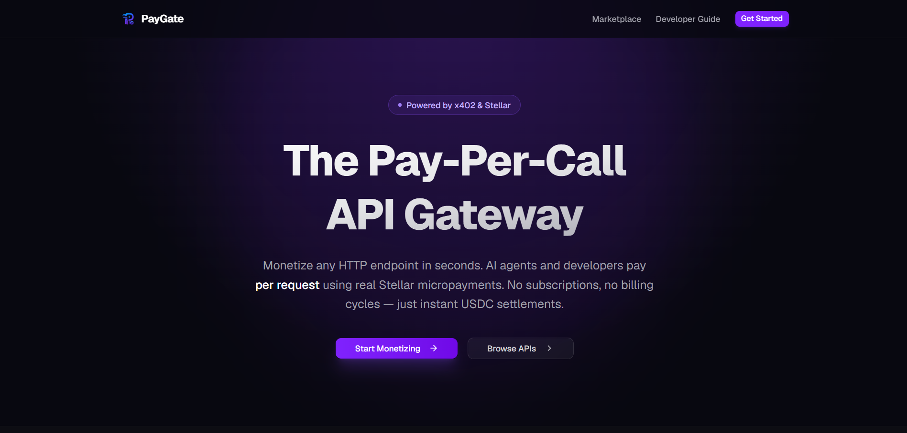<br>*The front door to the autonomous API economy.* | 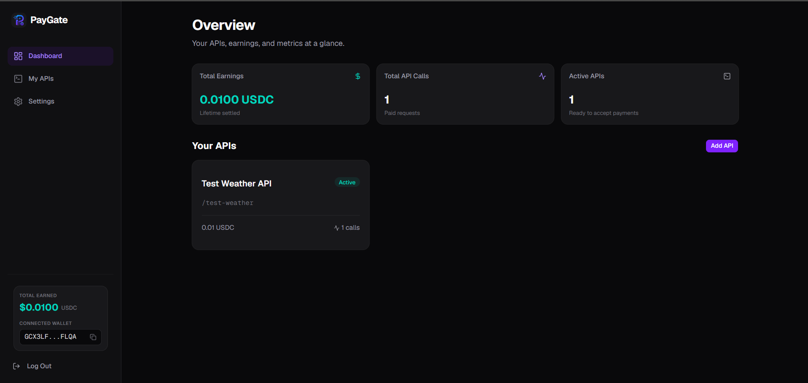<br>*Track your earnings, calls, and active APIs in real-time.* |

| Wallet Authentication | Register API |
|:---:|:---:|
| 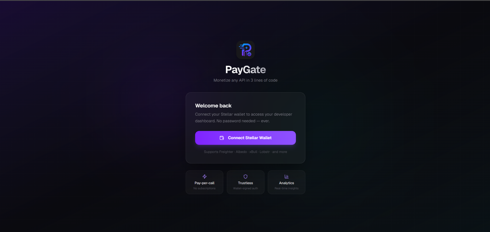<br>*Passwordless login via cryptographic Stellar wallet signature.* | 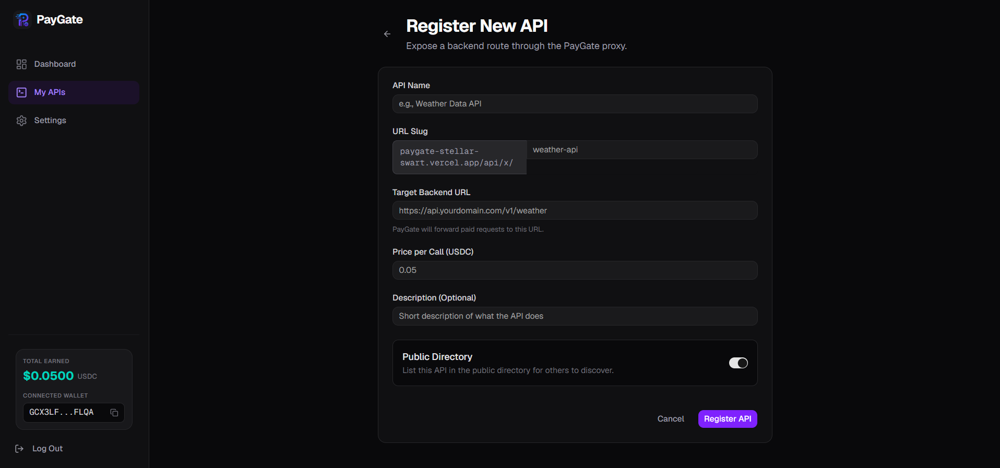<br>*Turn any backend URL into a monetized endpoint in seconds.* |

| API Marketplace | API Metrics |
|:---:|:---:|
| 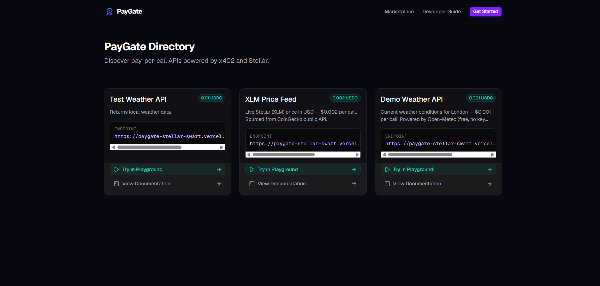<br>*Public directory for developers and agents to discover your APIs.* | 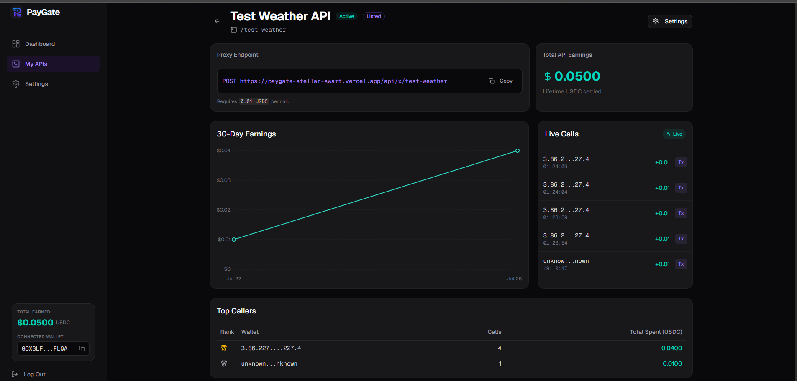<br>*Detailed analytics and transaction history for a specific API.* |

| Playground / Testing | Developer Guide |
|:---:|:---:|
| 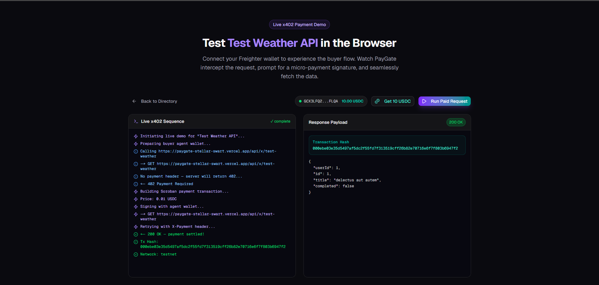<br>*Live in-browser simulation of an AI agent paying for your API.* | 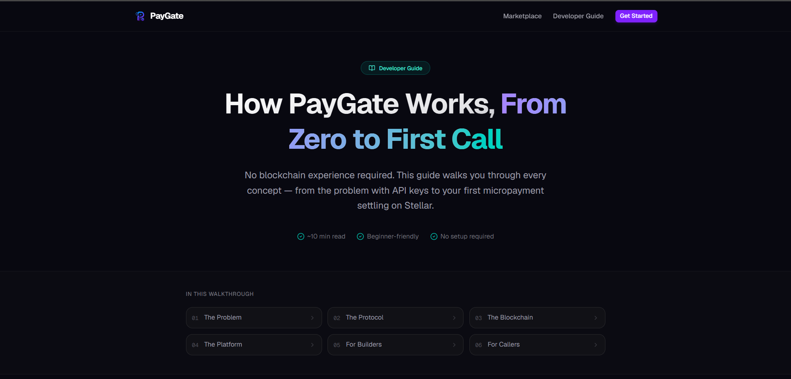<br>*Interactive, step-by-step onboarding for new developers.* |

| Settings | My APIs |
|:---:|:---:|
| 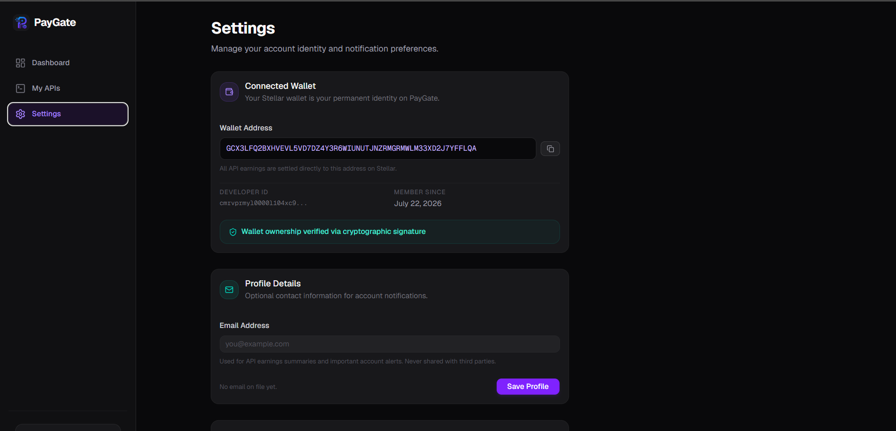<br>*Manage your profile and notification preferences.* | 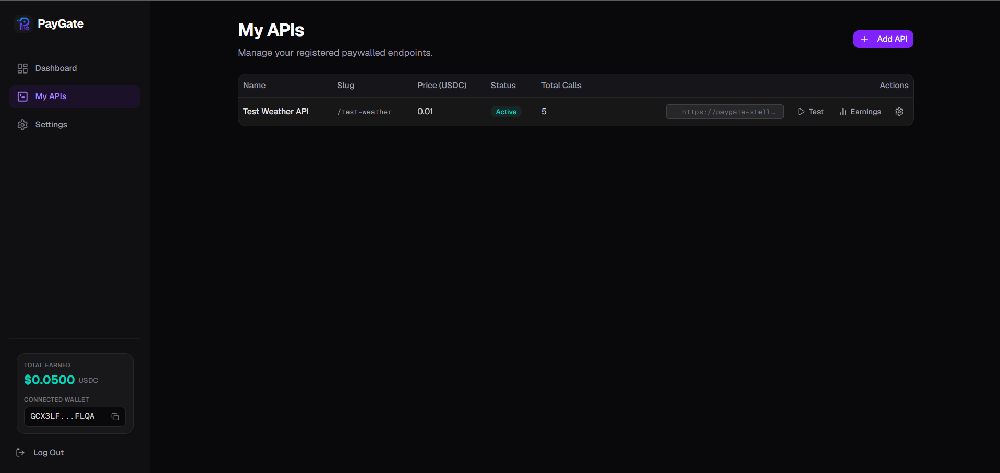<br>*Manage and configure your registered paywalled endpoints.* |

| Vercel Analytics | On-Chain Activity |
|:---:|:---:|
| 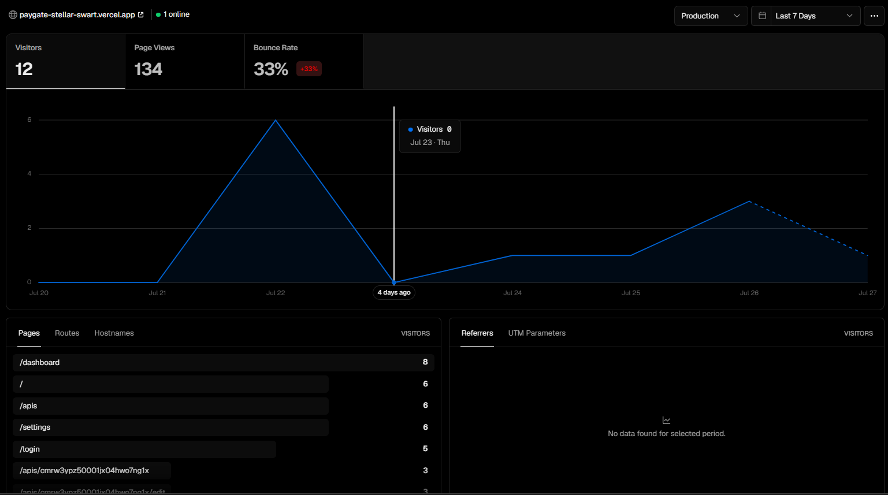<br>*Analytics added via Vercel Analytics to track traffic and usage.* | <br>*Transparent on-chain activity of the user on the Stellar network in this platform.* |

### 📱 Mobile Experience

PayGate is fully responsive, allowing developers to manage their APIs and view earnings on the go.

| Mobile Landing Page | Mobile Dashboard |
|:---:|:---:|
| 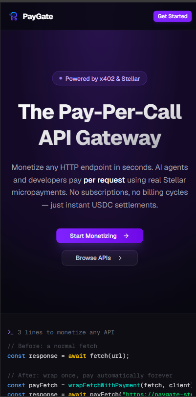 | 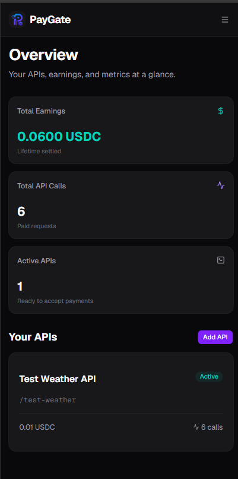 |

---

## 🛠️ Tech Stack

| Category | Technology | Purpose |
|---|---|---|
| **Frontend Framework** | Next.js (App Router) | Core application, routing, and SSR |
| **Styling & UI** | Tailwind CSS + shadcn/ui | Rapid, beautiful, and accessible component design |
| **Language** | TypeScript | Type safety across the full stack |
| **Database** | Neon (Serverless Postgres) | Persistent source of truth (Users, APIs, Call logs) |
| **ORM** | Prisma | Type-safe database access and migrations |
| **Cache / Rate Limiting** | Upstash (Redis) | High-speed rate limiting and live feed caching |
| **Blockchain** | Stellar (Soroban) | Fast, low-fee settlement layer for USDC micro-payments |
| **Protocol** | x402 | HTTP standard for machine-to-machine payments |

---

## ⛓️ Blockchain Integration (Stellar)

PayGate leverages the **Stellar Network** for its unparalleled suitability for micro-transactions:
1. **Low Fees:** Stellar transaction fees are fractions of a cent, making $0.001 API calls economically viable.
2. **Speed:** ~5-second ledger close times mean API requests are processed almost as fast as traditional web2 payments.
3. **USDC Native:** Stellar natively supports USDC, meaning developers earn real stablecoins, not volatile utility tokens.
4. **Soroban Smart Contracts:** Used for immutable, on-chain receipt verification and audit logs, ensuring trustless settlement between the agent and the API provider.

---

## 📂 File Architecture

```text
paygate/
├── apps/web/                      # Core Next.js Application
│   ├── src/app/
│   │   ├── api/x/[slug]/          # The x402 payment verification proxy middleware
│   │   ├── (app)/dashboard/       # Developer admin panel
│   │   └── marketplace/           # Public API directory
│   ├── src/components/            # Reusable UI components (shadcn/ui)
│   ├── src/lib/
│   │   ├── db/                    # Prisma database helpers
│   │   ├── x402/                  # Core protocol logic (facilitator, middleware)
│   │   └── stellar/               # Stellar network integration (signer, soroban)
│   └── prisma/                    # Database schema and migrations
├── contracts/                     # Soroban Smart Contracts (Rust)
│   ├── receipt-verifier/          # On-chain payment receipt logging
│   └── scripts/                   # Contract deployment utilities
└── scripts/                       # Local environment bootstrap and testing scripts
```

---

## 🔄 System Workflow

### API Registration Flow
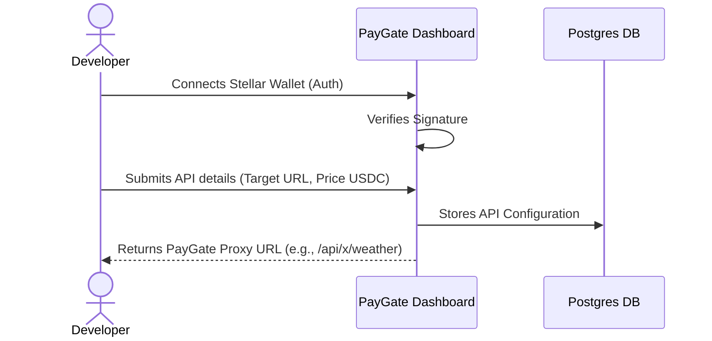

### AI Agent Payment Flow (x402 Protocol)
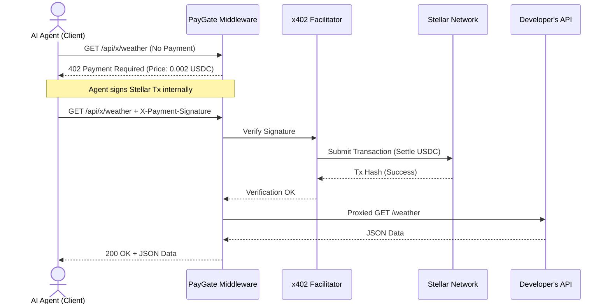

---

## ✨ Features

| Feature | Description |
|---|---|
| **Zero-Config Paywalls** | Turn any backend URL into a monetized API in seconds. No SDK required on the backend. |
| **Passwordless Auth** | Developers log in seamlessly using their Stellar wallet via cryptographic signatures. |
| **Instant USDC Settlement** | API calls are paid in USDC and settled directly to the developer's wallet on the Stellar network. |
| **Agent-Ready Protocol** | Fully implements the x402 protocol, allowing compliant AI agents to auto-negotiate payments. |
| **Real-time Analytics** | Live dashboard tracking earnings, active APIs, and a real-time feed of incoming API calls. |
| **Rate Limiting** | Built-in Redis-backed rate limiting to protect target APIs from abuse before payment verification. |
| **Interactive Playground** | Live in-browser demo simulating an AI agent making a payment, perfect for testing. |

---

## 📜 Smart Contracts

PayGate utilizes Soroban smart contracts on the Stellar network to maintain an immutable, decentralized log of payment receipts.

| Contract Name | Network | Contract ID | Verification Link |
|---|---|---|---|
| `receipt-verifier` | Stellar Testnet | `CBUGM2OM6Z3XSRTVN3Y4LI6SH3CXW2GUKNQL2FQKNERABFCNDT7DXRGI` | [Verify on Stellar Expert](https://stellar.expert/explorer/testnet/tx/c6d163583b3135c57a2614154ee0c7579040a90062599ab2b48671a9c4812170) |
| `paygate-router` | Stellar Testnet | `CDHAMAEXMNLHUDBF5EKF3OYYPHIRUOWWSSW6ML4ANDDRESHGTVGMRO3L` | [Verify on Stellar Expert](https://stellar.expert/explorer/testnet/tx/ddd38c2678e912554ab69e051f95d0d87c04d01f8057e81a2297123d814ec454) |
| `paygate-reputation` | Stellar Testnet | `CDEXJVXD4AAT73DDSEOEOCFZZFSYBKZAJFQ37EYFG3TS57F7E25HHHA6` | [Verify on Stellar Expert](https://stellar.expert/explorer/testnet/tx/156e22497f5406b11818b158417d31215065e135c607a7dfa333ef82d92bc08e) |

---

## ⚠️ Error Handling

PayGate ensures robust error handling across the entire payment and proxy lifecycle:

| Scenario | HTTP Status | Response / Action |
|---|---|---|
| **No Payment Provided** | `402 Payment Required` | Returns x402 headers detailing price, asset, and destination wallet for the agent to construct a transaction. |
| **Invalid Signature / Insufficient Funds** | `402 Payment Required` | Returns JSON error details (e.g., `invalid_exact_stellar_payload_fee_exceeds_maximum`). |
| **Target API Down/Timeout** | `502 Bad Gateway` | If the developer's target API fails *after* payment, logs the call as `failed` for audit purposes. |
| **Rate Limit Exceeded** | `429 Too Many Requests` | Blocks the request via Redis before hitting the x402 facilitator to prevent network spam. |
| **API Not Found / Inactive** | `404 Not Found` | Returns an error if the requested API slug doesn't exist or was deactivated by the developer. |

---

## 💎 Soroban Smart Contracts
To ensure true decentralization and on-chain verifiable behaviors, PayGate utilizes two custom Soroban smart contracts:
1. **PayGate Router (`contracts/paygate-router`)**: A decentralized router that automatically splits the paid USDC between the API Developer (e.g. 90%) and the Protocol Treasury (10%) seamlessly on-chain using the standard Stellar Asset Contract token client.
2. **PayGate Reputation (`contracts/paygate-reputation`)**: A staking and voting contract. Developers must stake a minimum of 1 USDC to have their API listed on the public marketplace, effectively curbing spam. Users can cast upvotes and downvotes on-chain to rank the APIs.

An included backend indexer (`scripts/indexer.ts`) listens to Soroban RPC events emitted by these contracts in real-time, syncing the state directly to the dashboard.

## 🧪 Testing

PayGate includes an interactive playground and end-to-end (E2E) testing scripts to verify the complete machine-to-machine payment flow.


*Running the E2E script simulating an AI agent paying for an API call.*

### Testing Guide
1. **Run the local dev server:** `npm run dev` inside `apps/web`.
2. **Setup Test Wallets:** Ensure `AGENT_STELLAR_SECRET_KEY` is in your `.env.local`. Run `npx tsx scripts/setup-wallets.ts` to establish USDC trustlines.
3. **Fund Agent Wallet:** Use the Circle Testnet Faucet to send USDC to your agent's public key.
4. **Run E2E Demo:** `npx tsx scripts/e2e-demo.ts`. Watch the terminal output as it hits the 402, auto-signs the transaction, and successfully fetches the data.

---

## 🚀 Project Setup Guide

1. **Clone the repository:**
   ```bash
   git clone https://github.com/yourusername/paygate.git
   cd paygate
   ```

2. **Install dependencies:**
   ```bash
   npm install
   ```

3. **Configure Environment:**
   Copy the example environment file and fill in your keys.
   ```bash
   cp apps/web/.env.example apps/web/.env.local
   ```
   *Required keys include Database URLs (Neon), Upstash Redis URLs, and your Stellar Treasury Wallet info.*

4. **Initialize Database:**
   ```bash
   cd apps/web
   npx prisma generate
   npx prisma db push
   ```

5. **Start the Development Server:**
   ```bash
   npm run dev
   ```
   *Visit `http://localhost:3000` to access the application.*

---

## 🔮 Future Implementation on Mainnet

Moving to Stellar Mainnet is a seamless transition designed into the architecture:
1. **Network Switch:** Change `STELLAR_NETWORK=testnet` to `pubnet` in the environment variables.
2. **Asset Switch:** Update the USDC asset configurations to point to the official Circle USDC issuer on Stellar Mainnet.
3. **Facilitator Migration:** Switch from the OpenZeppelin testnet facilitator to the production x402.org facilitator or self-host the facilitator node for ultimate control.
4. **Contract Deployment:** Deploy the `receipt-verifier` Soroban contract to Mainnet using the `deploy-mainnet.sh` script and update the `SOROBAN_CONTRACT_ID`.

---

## 📈 Future Plan, Opportunity, and Market

The API economy is currently valued at billions, but it completely excludes non-human actors. As Large Language Models (LLMs) evolve into autonomous agents capable of executing tasks, the demand for machine-accessible, pay-per-use data will skyrocket.

**Opportunities:**
- **Agentic Search Engines:** AI search engines paying micropayments to news sites directly per article scraped, replacing the broken ad-supported SEO model.
- **Compute Marketplaces:** Agents dynamically renting specialized GPU time or inference APIs on the fly, paying by the millisecond.
- **Micro-SaaS:** Independent developers monetizing niche datasets without needing to setup Stripe, handle KYC, or manage subscriptions.

**PayGate's Future Roadmap:**
- SDKs for popular agent frameworks (LangChain, AutoGPT) for native x402 support.
- API request batching to lower on-chain footprint for ultra-high-frequency trading agents.
- Reputation systems based on on-chain receipts to rate API reliability.

---

<div align="center">
  <i>Building the financial infrastructure for the autonomous economy. 🚀</i>
</div>
