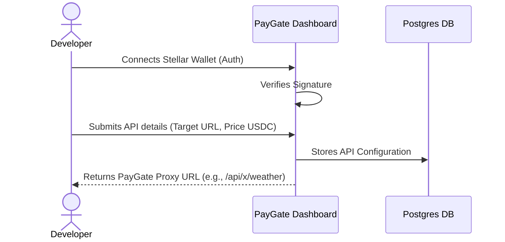
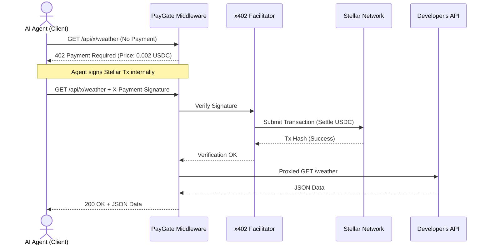

<div align="center">


# PayGate

**The open standard for AI-to-API micro-payments on Stellar.**


[](https://paygate-stellar-swart.vercel.app/)
[](https://youtu.be/We9RWRjFwhE)

</div>

---

## 🛑 The Problem

The current API economy is built for humans and credit cards, not AI agents. When an autonomous AI needs to access premium data (like real-time weather, stock prices, or compute APIs), it hits a paywall. To get past it, a human developer has to manually sign up for an API key, enter a credit card, commit to a monthly subscription, and hardcode that key into the agent. 

**This breaks the autonomy of AI.** AI agents cannot hold bank accounts or sign up for SaaS subscriptions. As we move towards an agent-to-agent economy, we need a way for software to autonomously negotiate and pay for data in real-time, on a per-request basis, without human intervention.

## 🌉 How PayGate Solves This (The x402 Protocol)

PayGate bridges this gap using the **x402 protocol** and the **Stellar blockchain**. 

When an AI agent requests data from a PayGate-protected API without a payment, the server intercepts the request and responds with a standard HTTP `402 Payment Required` status code. But instead of just an error message, the response includes an `x402` header containing a crypto invoice (specifying the price in USDC and the destination wallet).

The agent automatically intercepts this 402, constructs a micro-transaction on the Stellar network using its own built-in crypto wallet, and retries the request with the transaction signature attached. PayGate verifies the payment instantly and serves the data. 

**Result:** True machine-to-machine commerce. Pay-per-call, settled instantly in USDC, with zero subscriptions and zero human onboarding.

### 🏢 Real World Example Business

Imagine **"WeatherData Inc,"** a company that provides highly accurate, real-time meteorological data. 
- **Currently:** They sell $500/month enterprise API subscriptions. Startups and independent AI developers can't afford this, so WeatherData misses out on the long tail of the market.
- **With PayGate:** WeatherData registers their endpoint on PayGate and sets a price of **$0.002 USDC per call**. An autonomous farming drone AI needs wind data to optimize its flight path. It pings the API, pays $0.002 instantly from its onboard wallet, gets the data, and flies. WeatherData monetizes a micro-interaction they would have otherwise lost, and the AI remains fully autonomous.

---

## 🗣️ User Feedback

We are constantly improving PayGate based on developer feedback.
- **[Submit Feedback Form](https://forms.gle/uXD8V1NSdWmEhp7z7)**
- **[View Feedback Responses](https://docs.google.com/spreadsheets/d/1ZuNnwy3OEF6_WV_hg7zTXq6VYlpUsgL9_eiR7rBNLt4/edit?usp=sharing)**

---

## 📸 Platform Showcase

| Landing Page | Developer Dashboard |
|:---:|:---:|
| <br>*The front door to the autonomous API economy.* | <br>*Track your earnings, calls, and active APIs in real-time.* |

| Wallet Authentication | Register API |
|:---:|:---:|
| <br>*Passwordless login via cryptographic Stellar wallet signature.* | <br>*Turn any backend URL into a monetized endpoint in seconds.* |

| API Marketplace | API Metrics |
|:---:|:---:|
| <br>*Public directory for developers and agents to discover your APIs.* | <br>*Detailed analytics and transaction history for a specific API.* |

| Playground / Testing | Developer Guide |
|:---:|:---:|
| <br>*Live in-browser simulation of an AI agent paying for your API.* | <br>*Interactive, step-by-step onboarding for new developers.* |

| Settings | My APIs |
|:---:|:---:|
| <br>*Manage your profile and notification preferences.* | <br>*Manage and configure your registered paywalled endpoints.* |

### 📱 Mobile Experience

PayGate is fully responsive, allowing developers to manage their APIs and view earnings on the go.

| Mobile Landing Page | Mobile Dashboard |
|:---:|:---:|
|  |  |

---

## 🛠️ Tech Stack

| Category | Technology | Purpose |
|---|---|---|
| **Frontend Framework** | Next.js (App Router) | Core application, routing, and SSR |
| **Styling & UI** | Tailwind CSS + shadcn/ui | Rapid, beautiful, and accessible component design |
| **Language** | TypeScript | Type safety across the full stack |
| **Database** | Neon (Serverless Postgres) | Persistent source of truth (Users, APIs, Call logs) |
| **ORM** | Prisma | Type-safe database access and migrations |
| **Cache / Rate Limiting** | Upstash (Redis) | High-speed rate limiting and live feed caching |
| **Blockchain** | Stellar (Soroban) | Fast, low-fee settlement layer for USDC micro-payments |
| **Protocol** | x402 | HTTP standard for machine-to-machine payments |

---

## ⛓️ Blockchain Integration (Stellar)

PayGate leverages the **Stellar Network** for its unparalleled suitability for micro-transactions:
1. **Low Fees:** Stellar transaction fees are fractions of a cent, making $0.001 API calls economically viable.
2. **Speed:** ~5-second ledger close times mean API requests are processed almost as fast as traditional web2 payments.
3. **USDC Native:** Stellar natively supports USDC, meaning developers earn real stablecoins, not volatile utility tokens.
4. **Soroban Smart Contracts:** Used for immutable, on-chain receipt verification and audit logs, ensuring trustless settlement between the agent and the API provider.

---

## 📂 File Architecture

```text
paygate/
├── apps/web/                      # Core Next.js Application
│   ├── src/app/
│   │   ├── api/x/[slug]/          # The x402 payment verification proxy middleware
│   │   ├── (app)/dashboard/       # Developer admin panel
│   │   └── marketplace/           # Public API directory
│   ├── src/components/            # Reusable UI components (shadcn/ui)
│   ├── src/lib/
│   │   ├── db/                    # Prisma database helpers
│   │   ├── x402/                  # Core protocol logic (facilitator, middleware)
│   │   └── stellar/               # Stellar network integration (signer, soroban)
│   └── prisma/                    # Database schema and migrations
├── contracts/                     # Soroban Smart Contracts (Rust)
│   ├── receipt-verifier/          # On-chain payment receipt logging
│   └── scripts/                   # Contract deployment utilities
└── scripts/                       # Local environment bootstrap and testing scripts
```

---

## 🔄 System Workflow

### API Registration Flow


### AI Agent Payment Flow (x402 Protocol)


---

## ✨ Features

| Feature | Description |
|---|---|
| **Zero-Config Paywalls** | Turn any backend URL into a monetized API in seconds. No SDK required on the backend. |
| **Passwordless Auth** | Developers log in seamlessly using their Stellar wallet via cryptographic signatures. |
| **Instant USDC Settlement** | API calls are paid in USDC and settled directly to the developer's wallet on the Stellar network. |
| **Agent-Ready Protocol** | Fully implements the x402 protocol, allowing compliant AI agents to auto-negotiate payments. |
| **Real-time Analytics** | Live dashboard tracking earnings, active APIs, and a real-time feed of incoming API calls. |
| **Rate Limiting** | Built-in Redis-backed rate limiting to protect target APIs from abuse before payment verification. |
| **Interactive Playground** | Live in-browser demo simulating an AI agent making a payment, perfect for testing. |

---

## 📜 Smart Contracts

PayGate utilizes Soroban smart contracts on the Stellar network to maintain an immutable, decentralized log of payment receipts.

| Contract Name | Network | Contract ID | Verification Link |
|---|---|---|---|
| `receipt-verifier` | Stellar Testnet | `CDOF7XY3MGEKY3MNNJF5STMADAQRAFSHXP7WQIOCPEXM7O3BTPZYF7WH` | [Verify on Stellar Expert](https://stellar.expert/explorer/testnet/contract/CDOF7XY3MGEKY3MNNJF5STMADAQRAFSHXP7WQIOCPEXM7O3BTPZYF7WH) |

---

## ⚠️ Error Handling

PayGate ensures robust error handling across the entire payment and proxy lifecycle:

| Scenario | HTTP Status | Response / Action |
|---|---|---|
| **No Payment Provided** | `402 Payment Required` | Returns x402 headers detailing price, asset, and destination wallet for the agent to construct a transaction. |
| **Invalid Signature / Insufficient Funds** | `402 Payment Required` | Returns JSON error details (e.g., `invalid_exact_stellar_payload_fee_exceeds_maximum`). |
| **Target API Down/Timeout** | `502 Bad Gateway` | If the developer's target API fails *after* payment, logs the call as `failed` for audit purposes. |
| **Rate Limit Exceeded** | `429 Too Many Requests` | Blocks the request via Redis before hitting the x402 facilitator to prevent network spam. |
| **API Not Found / Inactive** | `404 Not Found` | Returns an error if the requested API slug doesn't exist or was deactivated by the developer. |

---

## 🧪 Testing

PayGate includes an interactive playground and end-to-end (E2E) testing scripts to verify the complete machine-to-machine payment flow.


*Running the E2E script simulating an AI agent paying for an API call.*

### Testing Guide
1. **Run the local dev server:** `npm run dev` inside `apps/web`.
2. **Setup Test Wallets:** Ensure `AGENT_STELLAR_SECRET_KEY` is in your `.env.local`. Run `npx tsx scripts/setup-wallets.ts` to establish USDC trustlines.
3. **Fund Agent Wallet:** Use the Circle Testnet Faucet to send USDC to your agent's public key.
4. **Run E2E Demo:** `npx tsx scripts/e2e-demo.ts`. Watch the terminal output as it hits the 402, auto-signs the transaction, and successfully fetches the data.

---

## 🚀 Project Setup Guide

1. **Clone the repository:**
   ```bash
   git clone https://github.com/yourusername/paygate.git
   cd paygate
   ```

2. **Install dependencies:**
   ```bash
   npm install
   ```

3. **Configure Environment:**
   Copy the example environment file and fill in your keys.
   ```bash
   cp apps/web/.env.example apps/web/.env.local
   ```
   *Required keys include Database URLs (Neon), Upstash Redis URLs, and your Stellar Treasury Wallet info.*

4. **Initialize Database:**
   ```bash
   cd apps/web
   npx prisma generate
   npx prisma db push
   ```

5. **Start the Development Server:**
   ```bash
   npm run dev
   ```
   *Visit `http://localhost:3000` to access the application.*

---

## 🔮 Future Implementation on Mainnet

Moving to Stellar Mainnet is a seamless transition designed into the architecture:
1. **Network Switch:** Change `STELLAR_NETWORK=testnet` to `pubnet` in the environment variables.
2. **Asset Switch:** Update the USDC asset configurations to point to the official Circle USDC issuer on Stellar Mainnet.
3. **Facilitator Migration:** Switch from the OpenZeppelin testnet facilitator to the production x402.org facilitator or self-host the facilitator node for ultimate control.
4. **Contract Deployment:** Deploy the `receipt-verifier` Soroban contract to Mainnet using the `deploy-mainnet.sh` script and update the `SOROBAN_CONTRACT_ID`.

---

## 📈 Future Plan, Opportunity, and Market

The API economy is currently valued at billions, but it completely excludes non-human actors. As Large Language Models (LLMs) evolve into autonomous agents capable of executing tasks, the demand for machine-accessible, pay-per-use data will skyrocket.

**Opportunities:**
- **Agentic Search Engines:** AI search engines paying micropayments to news sites directly per article scraped, replacing the broken ad-supported SEO model.
- **Compute Marketplaces:** Agents dynamically renting specialized GPU time or inference APIs on the fly, paying by the millisecond.
- **Micro-SaaS:** Independent developers monetizing niche datasets without needing to setup Stripe, handle KYC, or manage subscriptions.

**PayGate's Future Roadmap:**
- SDKs for popular agent frameworks (LangChain, AutoGPT) for native x402 support.
- API request batching to lower on-chain footprint for ultra-high-frequency trading agents.
- Reputation systems based on on-chain receipts to rate API reliability.

---

<div align="center">
  <i>Building the financial infrastructure for the autonomous economy. 🚀</i>
</div>
